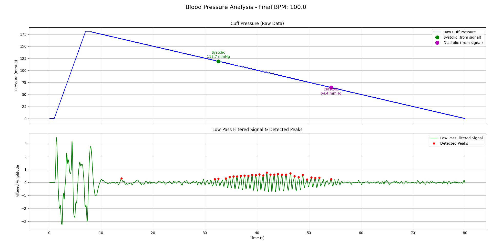

# Cardiac_Pressure_Monitor

Aplicação interativa para análise e visualização de sinais de pressão arterial e pulsos cardíacos, baseada no método oscilométrico.

---

## 📸 Demonstração

<!-- Insira aqui imagens ou GIFs do funcionamento da aplicação -->
<p align="center">
  
</p>

---

## 🩺 Funcionalidades

- Simulação da inflação e deflação de um manguito de pressão arterial
- Geração de sinais sintéticos de pulso cardíaco
- Visualização em tempo real dos sinais brutos e filtrados
- Detecção automática de picos para estimativa das pressões sistólica e diastólica
- Cálculo e exibição da frequência cardíaca (BPM)
- Exportação dos dados analisados para arquivo CSV
- Geração de gráficos finais com marcação dos picos detectados

---

## ⚙️ Especificações Técnicas

- **Linguagem:** Python 3
- **Bibliotecas:**  
  - [PyQtGraph](http://www.pyqtgraph.org/) (interface gráfica e gráficos em tempo real)  
  - [NumPy](https://numpy.org/) (operações numéricas)  
  - [SciPy](https://scipy.org/) (filtros e detecção de picos)  
  - [Matplotlib](https://matplotlib.org/) (gráficos finais)  
  - [CSV](https://docs.python.org/3/library/csv.html) (exportação de dados)
- **Plataforma:** Desktop (Windows, Linux, Mac)

---

## 🚀 Como Executar

1. **Clone o repositório:**
   ```sh
   git clone https://github.com/nivuciis/Cardiac_Pressure_Monitor
   cd Cardiac_Pressure_Monitor
   ```
2. **Instale as bibliotecas necessárias:**
   ```sh
   pip install -r requirements.txt
   ```
3. **Execute o aplicativo:**
   ```sh
   python main.py
   ```

---

## 📄 Licença

Este projeto está licenciado sob a Licença MIT. Veja o arquivo [LICENSE](LICENSE) para mais detalhes.

---

## 🛠️ Contribuição

Contribuições são bem-vindas! Sinta-se à vontade para enviar um pull request ou abrir uma issue para discutirmos melhorias.


--
